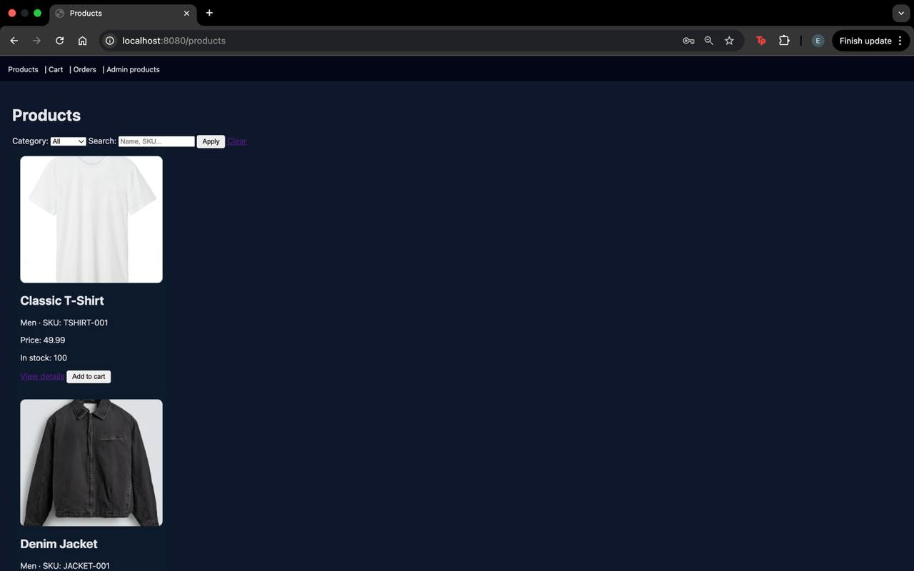
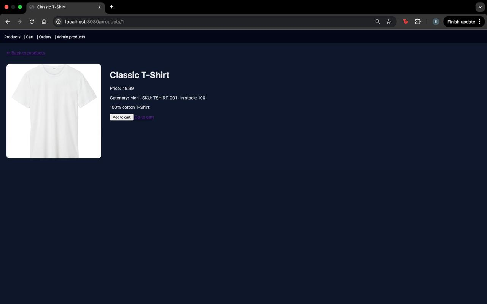
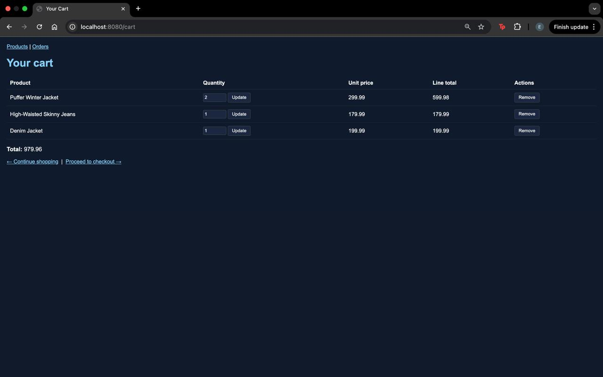
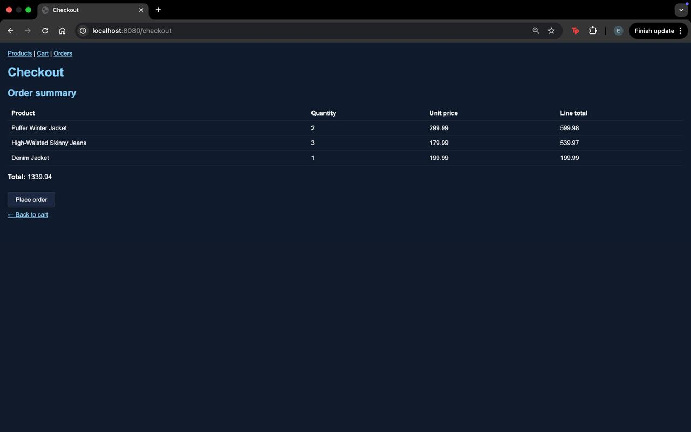
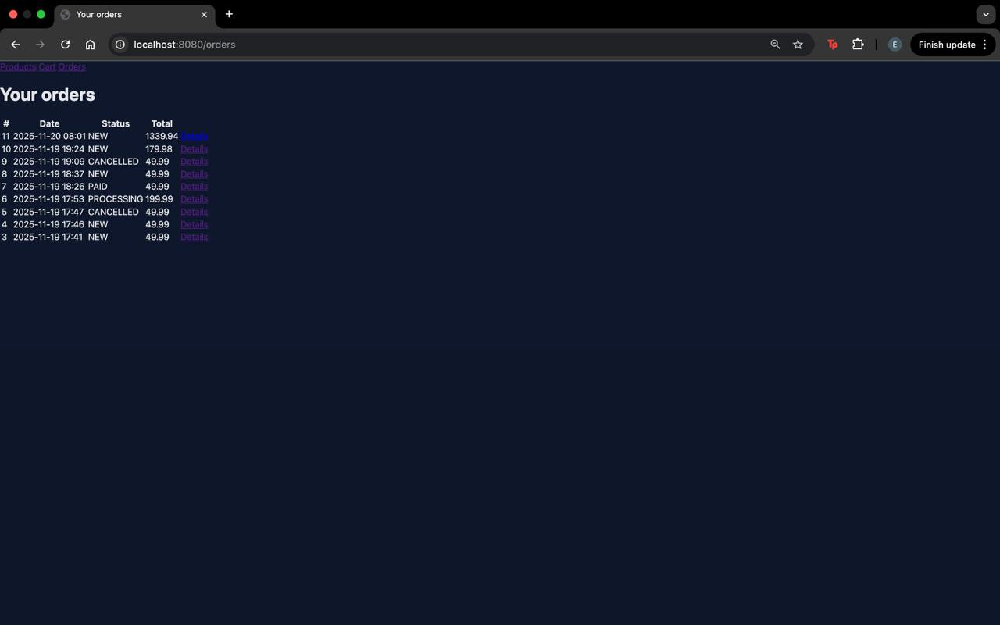
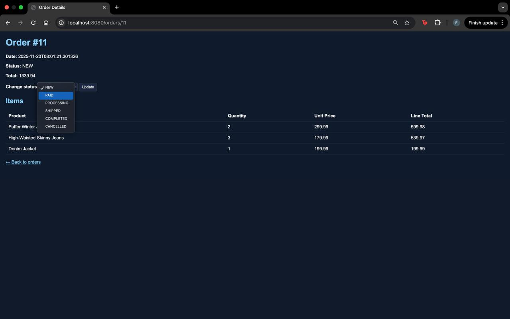
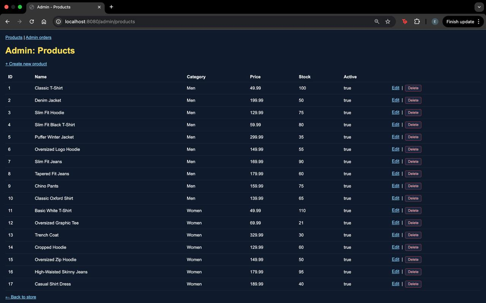
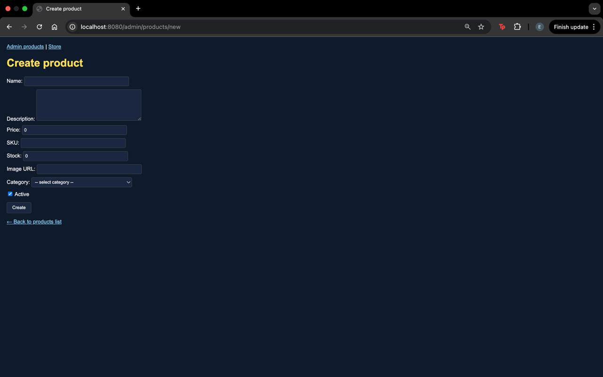

# Clothing Store Web Application

A full-stack **e-commerce web application** built with **Java Spring Boot** that allows users to browse products, manage a shopping cart, place orders, and enables administrators to manage products and orders.

---

## 🚀 Features

### User features
- Browse products with category filtering and search
- View product details
- Add products to cart
- Update cart quantities and remove items
- Checkout and place orders
- View order history
- View detailed order information
- User registration and login

### Admin features
- Admin panel for product management
- Create, update, and delete products
- Enable / disable products
- View all orders
- Update order status  
  `(NEW → PAID → PROCESSING → SHIPPED → COMPLETED / CANCELLED)`

---

## 🧱 Application Architecture

The application follows a **layered architecture**:

- **Controller layer** – handles HTTP requests and view rendering  
- **Service layer** – contains business logic  
- **Repository layer** – data access using Spring Data JPA  
- **Entity layer** – JPA entities mapped to database tables  
- **View layer** – Thymeleaf templates  

This separation improves maintainability, readability, and scalability.

---

## 🛠 Tech Stack

- Java  
- Spring Boot  
- Spring MVC  
- Spring Data JPA (Hibernate)  
- Thymeleaf  
- MySQL  
- HTML / CSS  
- Maven  

---

## 🗂 Main Functional Pages

### Store
- Product list page
- Product details page
- Shopping cart
- Checkout
- Orders list
- Order details

### Admin
- Products list
- Create product form
- Edit / delete products
- Order management panel

---

## 📸 Screenshots

Screenshots show the main application flows:

### Store

<table>
  <tr>
    <td></td>
    <td></td>
  </tr>
  <tr>
    <td align="center">Product List</td>
    <td align="center">Product Details</td>
  </tr>
</table>

<table>
  <tr>
    <td></td>
    <td></td>
  </tr>
  <tr>
    <td align="center">Shopping Cart</td>
    <td align="center">Checkout</td>
  </tr>
</table>

### Orders

<table>
  <tr>
    <td></td>
    <td></td>
  </tr>
  <tr>
    <td align="center">Orders List</td>
    <td align="center">Order Details</td>
  </tr>
</table>

### Admin Panel


<table>
  <tr>
    <td></td>
    <td></td>
  </tr>
  <tr>
    <td align="center">Admin – Products</td>
    <td align="center">Create Product</td>
  </tr>
</table>

- Product list and filtering  
- Product details  
- Cart (add, update, remove items)  
- Checkout and order confirmation  
- Orders list and order details  
- Admin product management  
- Admin product creation  
- User registration and login  


> You can find Screenshots in the `/screenshots` folder.

---

## ⚙️ Setup & Run

### Prerequisites
- Java 17+  
- Maven  
- MySQL  

### Database
Create a MySQL database, for example:

```sql
CREATE DATABASE clothes_store;
```
Update application.properties with your database credentials.

### Run the application
```bash
mvn clean install
mvn spring-boot:run
```
Open in browser:
```bash
http://localhost:8080/products
```

## 🔐 Authentication Notes

- Users can register and log in
- Admin access is required for product and order management

## 🎓 Purpose of the Project

This project demonstrates:

- Backend development with Spring Boot

- MVC and layered architecture

- CRUD operations

- Database design and JPA usage

- Realistic e-commerce workflows

It is intended for learning, portfolio presentation, and academic use.

## 👤 Author

Erlan Aytbaev

Computer Engineering student

Java / Spring Boot developer

GitHub: https://github.com/AytbaevErlan
